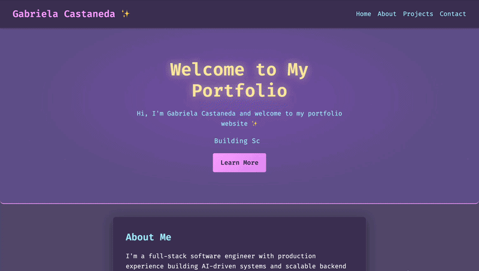

# Hi, I'm Gabriela Castaneda✨


Welcome to my personal portfolio website — a space where I showcase my work in **full-stack development, AI-powered systems, and cloud-based applications**.

**Live Site:** https://gabrielacastaneda.dev


## Backend Cold Start Notice

Some projects (such as **Portfolio Pilot** and **Emergent Societies**) rely on backend services hosted on Render’s free tier.

- Initial load may take **30–60 seconds**
- This is due to backend cold start after inactivity
- Performance returns to normal after startup

> If a page does not load immediately, please wait a moment and refresh.


## Demo




## What I Bring

- Experience building **production-level AI systems** using LLMs and multi-agent architectures  
- Strong experience in **full-stack development** (React, FastAPI, SQL)  
- Ability to take projects from **idea → deployed product**  
- Focus on **performance, scalability, and real-world usability**  


## About This Project

This portfolio is a **modern, responsive single-page application** built to highlight my experience as a software engineer and my work across AI, backend systems, and full-stack applications.

It’s designed with a focus on:
- Clean UI/UX
- Interactive elements and animations
- Real-world projects and production experience
- Recruiter-friendly navigation


## Why I Built This

I created this portfolio to showcase not just my projects, but my ability to build **real-world, production-ready systems**.

Each project reflects my interest in:
- AI-powered applications
- Scalable backend systems
- Creating tools that provide real value to users

This site is a central hub for my work as I continue growing into a full-stack and cloud-focused software engineer.


## Featured Experience & Projects

### Software Engineer Intern — Sensatronix (Svistas)

- Built and improved an AI-powered onboarding system using multi-agent architecture
- Worked with **LLMs, backend services, and cloud infrastructure**
- Contributed to production-level features and debugging complex distributed systems


### Portfolio Pilot

[🔗 Live Demo](https://www.portfoliopilotai.dev/)  
[💻 View Code](https://github.com/gdoeg/portfolio-pilot)  

AI-powered portfolio analysis platform that:
- Provides investment insights using LLMs
- Tracks portfolio performance and metrics
- Integrates financial data APIs

**Tech:** React, TypeScript, FastAPI, PostgreSQL, Groq, APIs


### Emergent Societies

[🔗 Live Demo](https://emergent-societies.vercel.app/)  
[💻 View Code](https://github.com/gdoeg/emergent-societies)

Simulation system modeling agent-based interactions and economic behavior.
- Explores **emergent behavior and inequality dynamics**
- Built with scalability and experimentation in mind
- Presented as research at the University of Washington Undergraduate Symposium May 2026


## Tech Stack

**Frontend**
- React 19
- TypeScript
- Vite

**Styling & UI**
- Custom CSS
- Responsive design
- Animated UI elements
- Framer Motion

**Other**
- API integrations
- AI/LLM systems (Groq / Gemini)
- Cloud deployment (Render, Vercel)


## Site Sections

- **Home** – Introduction and quick overview  
- **About** – Background and technical focus  
- **Projects** – Featured work and experience  
- **Contact** – Links to GitHub, LinkedIn, and email 


## Running Locally

```bash
cd frontend
npm install
npm run dev
```

## Contact

- GitHub: https://github.com/gdoeg  
- LinkedIn: https://www.linkedin.com/in/gabriela-castaneda-4aa04019a/  
- Email: gabrielacastanedagc@gmail.com  


## Currently Working On

- Scaling agent-based simulations in Emergent Societies  
- Enhancing AI-driven insights in Portfolio Pilot  
- Preparing for full-time software engineering roles (2026)  

## Notes

This portfolio is actively maintained and continuously evolving as I build new projects and gain experience in software engineering, AI, and cloud systems.
